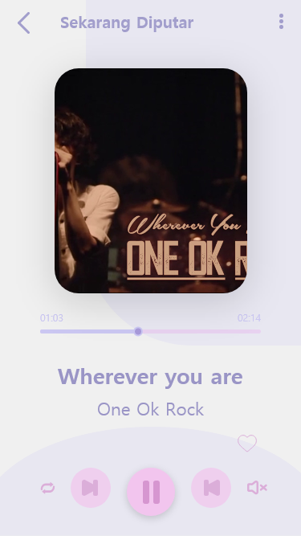
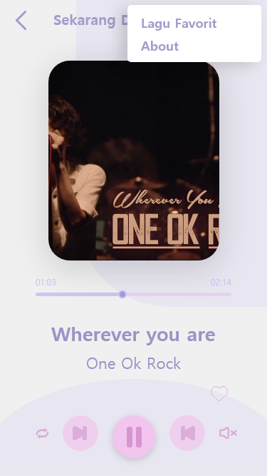
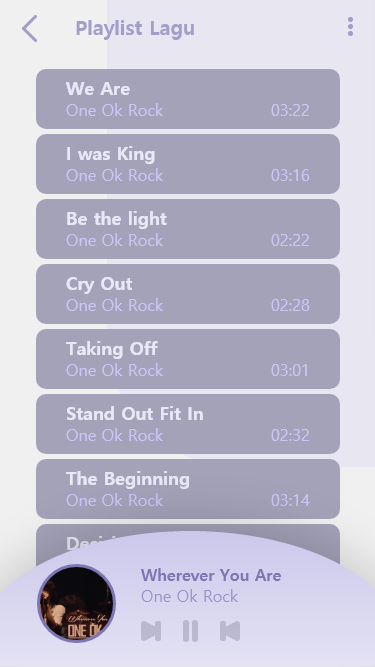
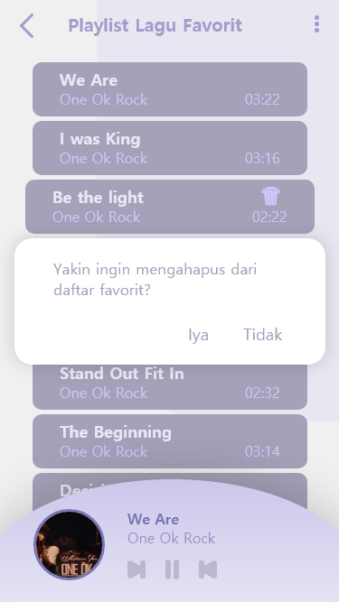

# **SmartMusicPlayer Us**

Simply, it's just like any other music player apps, but integrated with Speech Recognition.
This application developed to fulfill the final project of the Mobile Computing subject in my college which is taught by Alfa Faridh Suni, S.T., M.T. and Feddy Setio Pribadi, S.Pd., M.T.

The purpose of making this application is that the application can provide more convenience to users with the Speech Recognizer technology which can receive direct commands from the user so that without looking at the application or clicking on the user interface, the user can still control the music playlist as desired.

## The Features

-	User Interface for controlling the music playlist, which are:
    1.	to control songs that are currently played.
    2.	to manage playlist songs.
    3.	to manage playlist fav songs.
-	A notification that is able to control the music currently played.
-	Integrated with SpeechRecognizer technology so that it can receive predefined commands directly from the users.

## UI Design

- SplashScreen

- SmartMusicPlayerActivity

- SmartMusicPlayerActivity in Smart Mode

- Popup Menu Options with Active Popup

- PlaylistSongsActivity

- PlaylistFavSongsActivity

- PlaylistFavSongsActivity with Active Popup

